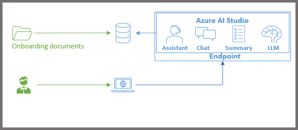

# Patient Onboarding Copilot
This repository is hosted as a part of FSI Hackathon for Autism (https://github.com/fsi-hack4autism)

## Objective: Help BCBA onboard a new patient quickly
Typically, a BCBA gets limited amount of time to onboard a new patient and this can be a very cumbersome task. It includes several types of information to intake:
* Patient demographics, medical history, past services, etc.
* Historical evaluations, IEPs, etc.
* Insurance, funding, billing information, etc.
* Previous and current treatments and their outcomes, progress reports, etc.
* Consent forms, contracts, letter of engagement, etc.

### Sample Scenarios
* The co-pilot will be able to ingest historical documents
* It will allow parents, BCBAs, and RBTs to actively collaborate across sessions - such as allowing parents to provide inputs of progress outside of sessions
* It will allow tracking documents and provide a platform for storing consents, authorizations, etc.
* It can generate a summarization of the new patient for the BCBA to review

### Architecture

## Code repository setup
This repository will host multiple code bases to make it easy for patient to onboard to a new BCBA (Board Certified Behavioral Analyst). Largely, the repository will contain projects in the following areas:
### Onboarding tasks
* Help the patient provide all past non-medical information such as insurance, billin, letters of engagement, past services, etc.
* Help the patient provide all past medical information such as past treatment plans, IEPs, medical history, etc.
* It can be a chatbot interface or tutorials etc.
Note: Create all projects in a folder under https://github.com/fsi-hack4autism/patient-onboarding-copilot/tree/main/onboarding
### Copilot creation
* Focus is on retrieving data using a copilot
  * This module will summarize the patient data for the BCBA
  * The copilot will assist through various interfaces - summary reports, chatbots, images & screenshots, video snippets, etc.
Note: Create all projects in a folder under https://github.com/fsi-hack4autism/patient-onboarding-copilot/tree/main/copilot
